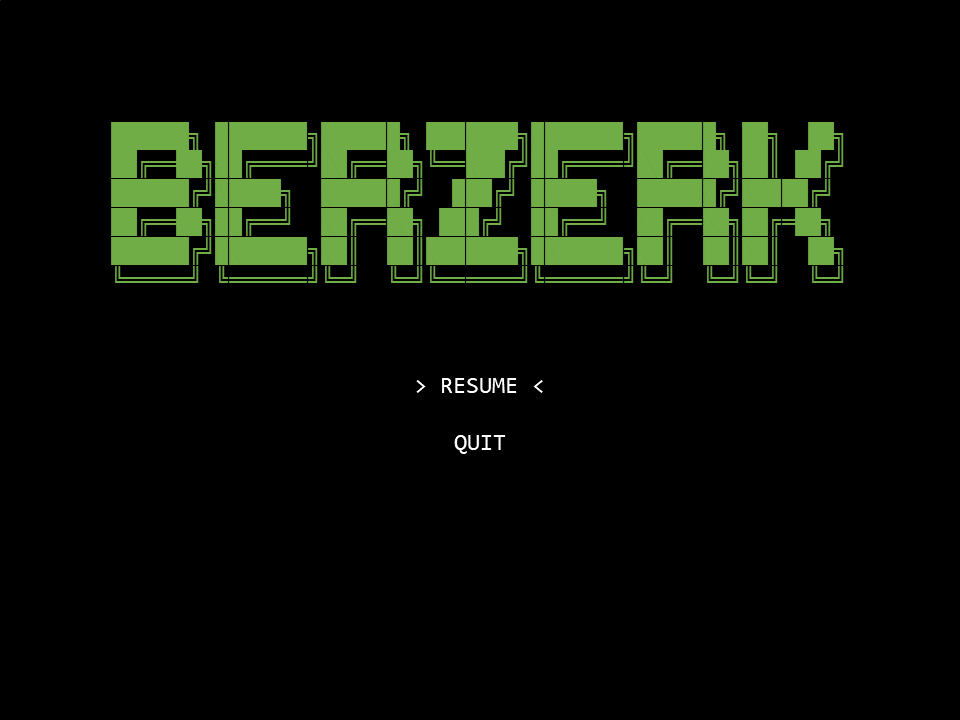

## LDTS_l04gr02 - Berzerk

**Berzerk** é um jogo de ação e tiros. O objetivo do jogo passa por percorrer labirintos com paredes eletrificadas com vários inimigos robôs espalhados pelo mapa. O jogador tem a possibilidade de usar tiros para destruir os robôs e ganhar pontos enquanto se desvia dos inimigos e dos tiros que estes também disparam. O jogador também tem de se desviar das paredes eletrificadas para não perder pontos de vida. O jogo continua até que o jogador perca todas as vidas ou atinja a pontuação máxima. A dificuldade tende a aumentar à medida que o jogador avança de nível.

Projeto realizado por *Gonçalo Nunes* (up202205538@up.pt), *Nuno Machado* (up202206186@up.pt) e *Vítor Pires* (up202207301@up.pt) no âmbito da unidade curricular LDTS 2023⁄24.

Pode consultar mais informações [aqui](./docs/README.md).

### FUNCIONALIDADES

- **Gráficos e interface**: implementação gráfica dos diversos elementos do jogo (nomeadamente, representações visuais para o labirinto, personagens, tiros, pontuações e outros elementos); a Imagem do StickMan e dos Robôs reage ao próprio movimento;
- **Main menu**: permite iniciar o jogo, consultar uma tabela de classificação com as melhores pontuações, consultar as instruções do jogo ou sair da aplicação;
- **Labirinto**: leitura de mapas através de ficheiros de texto; progressão de níveis, com nível de dificuldade crescente
- Jogador controla um stickman que deve sobreviver, eliminando inimigos e evitando ser atingido por eles, pelos disparos destes, ou pelos obstáculos presentes no cenário.
- **Movimento do StickMan**: através de inputs do jogador;
- **Inimigos**: os robôs perseguem o StickMan (alguns disparam na direção do jogador); EvilSmile: inimigo indestrutível que persegue o jogador se este demorar muito num nível, aumentando a dificuldade e incentivando a movimentação constante.
- **Disparos e colisões**: desenvolvimento da mecânica de disparos e colisões do personagem principal e dos inimigos. Ser atingido por tiros ou colidir com inimigos resulta na perda de uma vida.
- **Pontuação e níveis**: sistema de pontuação recompensa o jogador por destruir inimigos ou alcançar objetivos específicos.
- **Ecrã de Game Over**: o jogo continua até que o jogador perca todas as suas vidas. Quando isso acontece, a partida acaba, e o jogador tem a opção de inserir os seus dados para registar a pontuação alcançada.
- Diferentes Power Ups do StickMan
- **Efeitos sonoros**: acompanham as ações do jogo, como disparos, colisões, conquistas, entre outros.

### MOCKUPS

MainMenu

PauseMenu

Leaderboard

GamePlay

