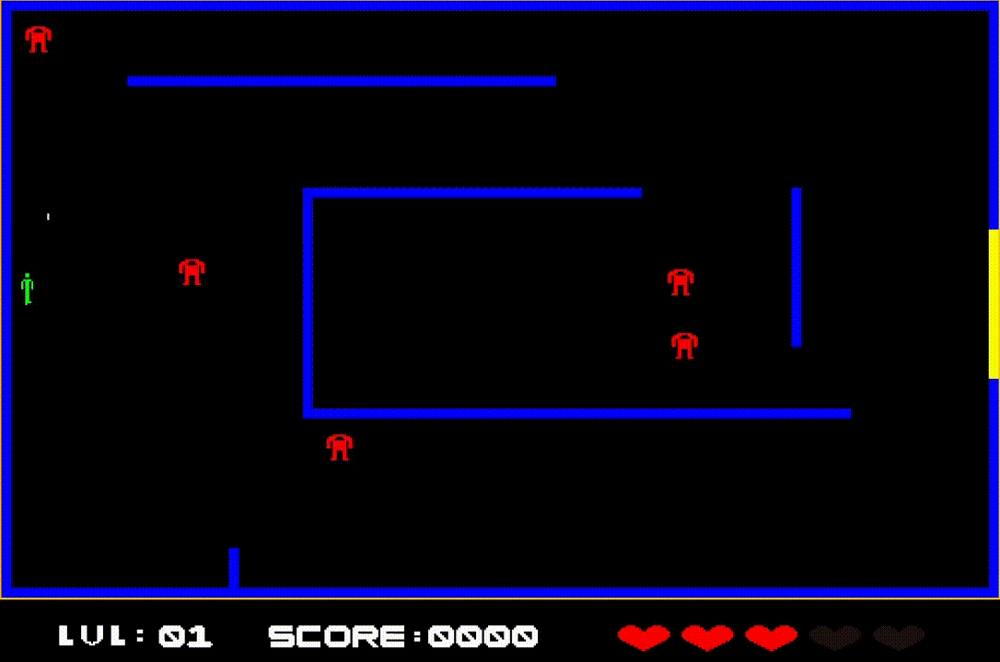
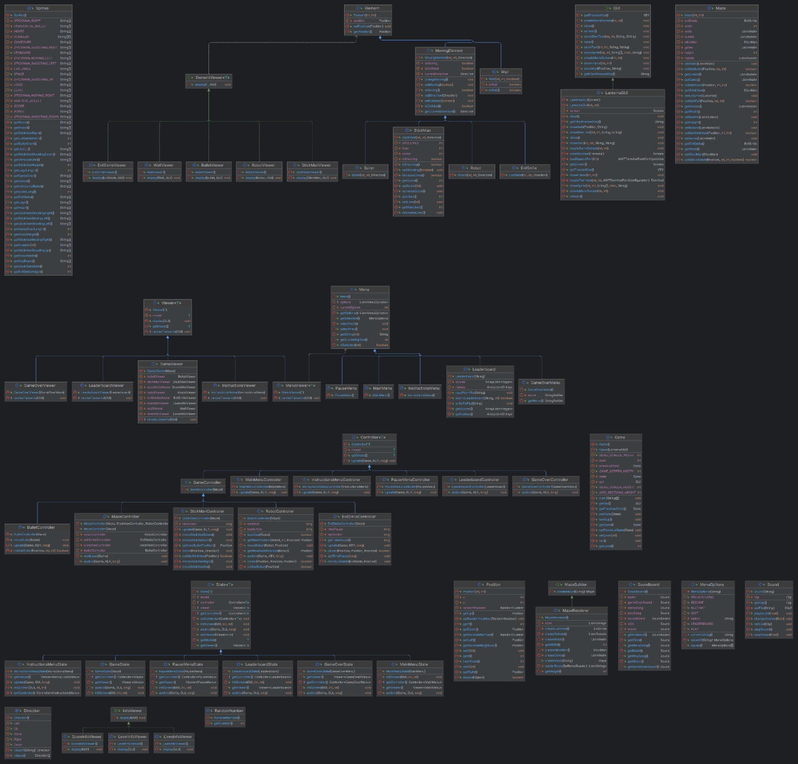
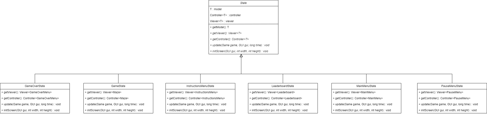
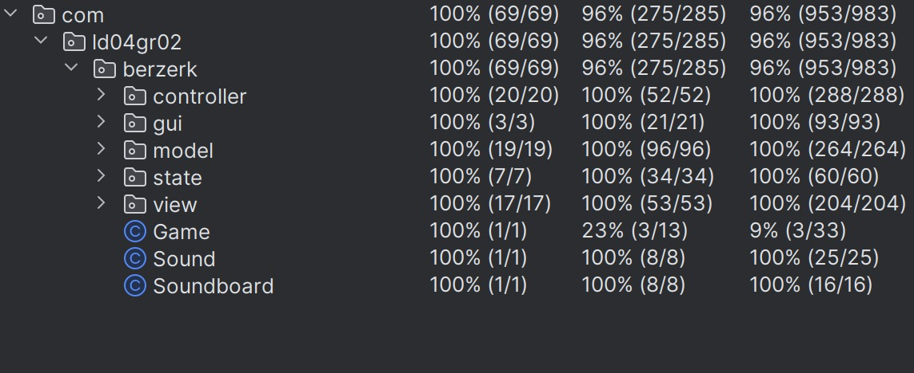
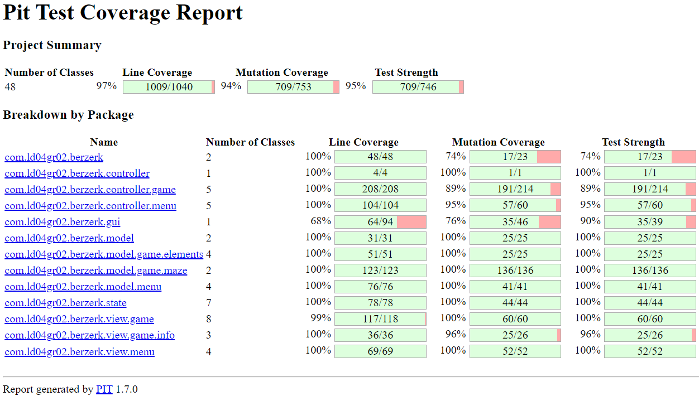

# LDTS_l04gr02 - Berzerk

> **Berzerk** is an action and shooting game. The game's objective revolves around navigating mazes with electrified walls while encountering various enemy robots scattered throughout the map. The player has the ability to use shots to destroy the robots and earn points while dodging both enemies and the shots they fire. Additionally, the player must evade electrified walls to prevent losing life points. The game continues until the player loses all lives or reaches the maximum score. The difficulty tends to increase as the player advances levels.

This project was developed by *Gonçalo Nunes* (up202205538@up.pt), *Nuno Machado* (up202206186@up.pt) e *Vítor Pires* (up202207301@up.pt) for LDTS 2023⁄24.

### HOW TO PLAY
- The player controls a StickMan using the keyboard's arrow keys to move in four directions: right, left, up, and down.
- Throughout the map, there are enemies that pursue StickMan, reducing his life if they make contact.
- Therefore, it's crucial for the player to stay alert and keep a distance from the enemies.
- To score points, the player must eliminate the robots by shooting bullets with the Space key. Note that robots also shoot at Stickman.
- The Evil Smile is a special enemy. It is indestructible, doesn't collide with walls or bullets, and pursues the Stickman. Initially, its speed is low. However, its speed increases over time, urging the player to complete each level quickly to avoid being caught by the Evil Smile.
- Once the last robot is destroyed, the gate (a yellow area on the far right of the map) opens, clearing the path to the next level.
- The player starts with 3 lives and 0 points. Each destroyed robot adds 50 points to the player's score. The player earns an extra life for every 500 points scored during gameplay.

> Quick reflexes, smart moves, and sharp shooting against a bunch of chasing enemies are key elements to survive and progress in Berzerk!

## IMPLEMENTED FEATURES

- **Graphics and Interface**: graphical implementation of various game elements (including visual representations for the maze, characters, shots, scores, and other elements); StickMan and Robot Images react to their movement;
- **Main Menu**: allows starting the game, checking a leaderboard with top scores, accessing game instructions, or exiting the application;
- **Leaderboard**: displays top scores achieved by players;
- **Game Instructions**: provides clear guidance on game rules and controls for players' understanding;
- **Maze**: reading maze configurations from text files;
- **Stickman**: Player controls a stickman that must survive by eliminating enemies and avoiding being hit by them, their shots, or the obstacles present in the scenario.
- **StickMan Movement**: through player inputs;
- **Enemies**: robots chase the StickMan (some shoot in the player's direction), EvilSmile is a indestructible enemy that pursues the player, increasing difficulty and encouraging constant movement.
- **Shots and Collisions**: development of shooting and collision mechanics for the main character and enemies. Being hit by shots, colliding with enemies or being electrocuted by the electrified walls results in the loss of a life. If two robots collide, they kill each other. Evil Smile is immune to collisions, but kills robots and the player.
- **Scoring**: scoring system rewards the player for destroying enemies (max. score = 9950);
- **Lives**: the player begins the game with 3 lives and can have a max. of 5 lives, the player earns an extra life for every 500 points scored during gameplay;
- **Levels**: The gate of the maze opens after the player kills all the robots, and upon crossing the gate, the player advances to the next level (max. displayed level: 99, but the game continues beyond that point ).
- **Game Over Screen**: the game continues until the player loses all their lives. When this happens, the game ends, and the player has the option to record the achieved score (which will be saved only if it qualifies to enter the leaderboard);
- **Sound Effects**: distinct sounds for the menu, gameplay ambiance, shooting actions, and collision events.

## MOCKUPS

MainMenu

PauseMenu

Leaderboard

GamePlay

## SCREENSHOTS

Game Preview

MainMenu

PauseMenu

Instructions

Leaderboard

GamePlay

Game Over

## IMPLEMENTATION

### UML

## DESIGN PATTERNS

### Architectural Pattern - MVC (Model-View-Controller)

#### Problem in context:
- Managing data (Model), user interface (View), and user interactions (Controller) in a single structure could lead to tangled code and maintenance challenges.

#### The pattern:
- MVC separates an application into three main components: Model (only represents the data), View (displays the model data and sends user actions to the controller), and Controller (provides model data to view and interprets user actions).

#### Implementation:

- The packages - Model, View and Controller - can be found, respectively, in:
    - [Model](https://github.com/FEUP-LDTS-2023/project-l04gr02/tree/main/src/main/java/com/ld04gr02/berzerk/model)
    - [Controller](https://github.com/FEUP-LDTS-2023/project-l04gr02/tree/main/src/main/java/com/ld04gr02/berzerk/controller)
    - [View](https://github.com/FEUP-LDTS-2023/project-l04gr02/tree/9e535c984c979dfa7cf10b7be44f49e298b246de/src/main/java/com/ld04gr02/berzerk/view)

#### Consequences:
- Easier maintenance, and updates. Enhances code reusability and scalability.

### State

#### Problem in context:

- We want game class to exhibit different behaviors based on the game's state.

#### The pattern
- State pattern lets an object alter its behavior when its internal state changes. It appears as if the object changed its class.
- Each state class encapsulates specific behaviors and functionalities that correspond to the respective game state.

#### Implementation
Class Diagram:

State Diagram:

#### Consequences:
- Organize the code of the various states into individual classes;
- Introduce new states in a much easier way, without having to change existing state classes or the context;

### Singleton

#### Problem in context:
- **Problem**: Excessive object creation leading to resource depletion or conflicts.
- **Context**: We chose to implement the Singleton pattern due to 'javax.sound.sampled.LineUnavailableException' error, which occurred because multiple instances of sound-related objects were being created concurrently.

#### The pattern:
- Singleton restricts a class to have only one instance and offers global access to that instance.

#### Implementation:
- The Soundboard class declares the static method getInstance that returns the same instance of its own class (calling the getInstance method should be the only way of getting the Singleton object)

#### Consequences:
- **Pros**: guarantees a single instance throughout the application, offering a global access point for that instance; allows a more efficient management of resources, avoiding redundant object creation;
- **Cons**: it is more difficult to test code;

### DEVELOPMENT HIGHLIGHTS

#### Fully remade Sound system

Problem:
The game was experiencing memory-related crashes after running for an extended period. The issue was identified to be related to the sound system ('javax.sound.sampled.LineUnavailableException' error).

Solution:
To limit the number of sound instances, we decided to redesign the sound system. We created a new class called Soundboard, which holds instances of all the sounds used in the game (e.g., bullet sound, collision sound, background music). The Soundboard class was implemented using the Singleton design pattern. This way, only one instance of Soundboard is created, and sounds are played through this single instance, eliminating memory issues associated with multiple sound instances.

To see the commit click [here](https://github.com/FEUP-LDTS-2023/project-l04gr02/commit/3e2ba1a619297499e68ccf431295e38a07119770).

#### The game is two times faster

Problem:
To create the illusion of the StickMan character walking, we were drawing the game map twice for each movement, resulting in a loss of performance as the game expanded.

Solution:
We adjusted the drawing functions so that only one drawing per cycle was needed, maintaining the illusion of StickMan movement.

To see the commit click [here](https://github.com/FEUP-LDTS-2023/project-l04gr02/commit/33f164c79952fbddc0ae0603ece01d824737375d).

#### Fixed bullet collision bug

Problem: 
For a game of this type to make sense, accurate collision detection is crucial. Previous collision implementations had issues.

Solution:
We addressed the last remaining collision issues, specifically focusing on bullet collisions with map walls. This ensures that all collisions in the game are tested and handled correctly, contributing to a more meaningful gameplay experience.

To see the commit click [here](https://github.com/FEUP-LDTS-2023/project-l04gr02/commit/9297d06aadb9deb9277e44078c29971e501cace8).

#### Implemeted levels

We implemented levels in the game.
To see the commit click [here](https://github.com/FEUP-LDTS-2023/project-l04gr02/commit/ef94cb14838dc7b374cf2a88fa85e8305f63435b).

### ERROR-PRONE WARNINGS
- No error-prone warnings.

### CODE SMELLS

- Sprites class is a bit large due to the inclusion of multiple static arrays along with the necessity of implementing public static accessor methods for these arrays, in accordance with error-prone recommendations, resulting in increased code volume and complexity.

### TEST COVERAGE

### MUTATION TESTING (PITEST)

To consult the report, click [here](202312232308/index.html).

### SELF-EVALUATION

- Gonçalo Nunes 33,3%
- Nuno Machado: 33,3%
- Vítor Pires: 33,3%