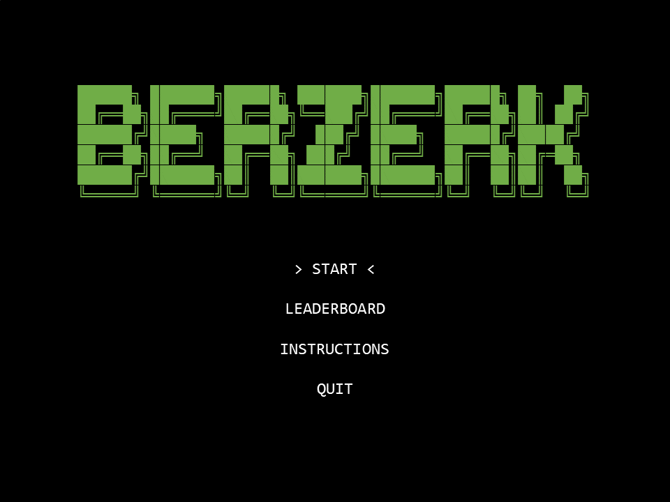
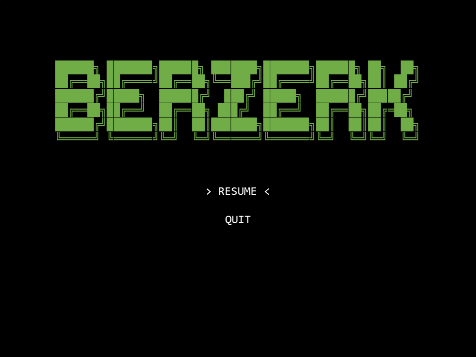
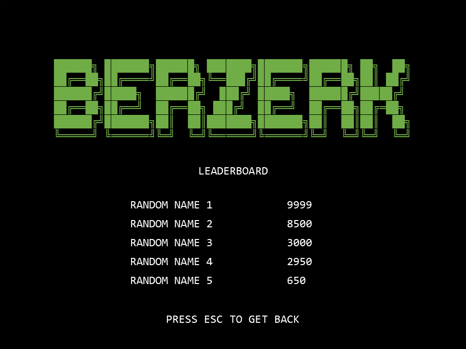
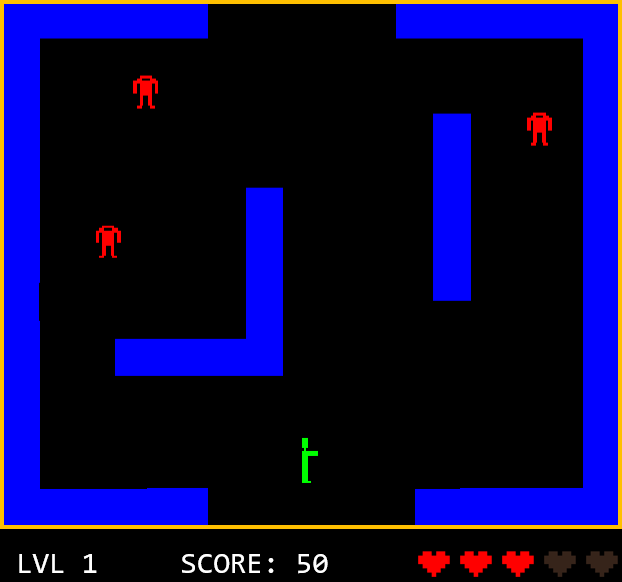
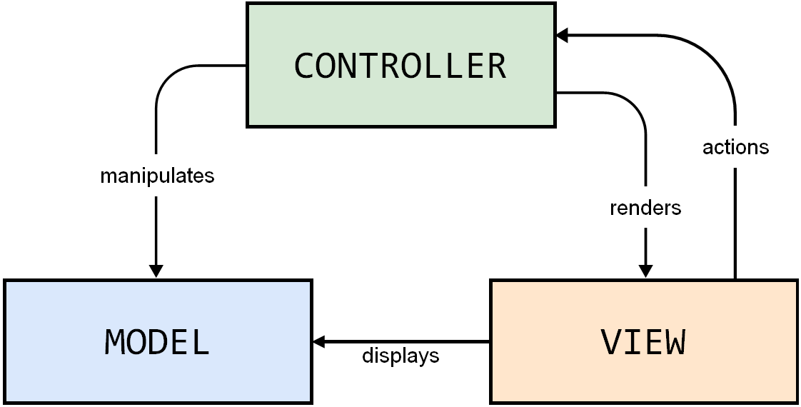

## LDTS_l04gr02 - Berzerk

**Berzerk** é um jogo de ação e tiros. O objetivo do jogo passa por percorrer labirintos com paredes eletrificadas com vários inimigos robôs espalhados pelo mapa. O jogador tem a possibilidade de usar tiros para destruir os robôs e ganhar pontos enquanto se desvia dos inimigos e dos tiros que estes também disparam. O jogador também tem de se desviar das paredes eletrificadas para não perder pontos de vida. O jogo continua até que o jogador perca todas as vidas ou atinja a pontuação máxima. A dificuldade tende a aumentar à medida que o jogador avança de nível.

Projeto realizado por *Gonçalo Nunes* (up202205538@up.pt), *Nuno Machado* (up202206186@up.pt) e *Vítor Pires* (up202207301@up.pt) no âmbito da unidade curricular LDTS 2023⁄24.

### FUNCIONALIDADES

- **Gráficos e interface**: implementação gráfica dos diversos elementos do jogo (nomeadamente, representações visuais para o labirinto, personagens, tiros, pontuações e outros elementos); a Imagem do StickMan e dos Robôs reage ao próprio movimento;
- **Main menu**: permite iniciar o jogo, consultar uma tabela de classificação com as melhores pontuações, consultar as instruções do jogo ou sair da aplicação;
- **Labirinto**: leitura de mapas através de ficheiros de texto; progressão de níveis, com nível de dificuldade crescente
- Jogador controla um stickman que deve sobreviver, eliminando inimigos e evitando ser atingido por eles, pelos disparos destes, ou pelos obstáculos presentes no cenário.
- **Movimento do StickMan**: através de inputs do jogador;
- **Inimigos**: os robôs perseguem o StickMan (alguns disparam na direção do jogador); EvilSmile: inimigo indestrutível que persegue o jogador se este demorar muito num nível, aumentando a dificuldade e incentivando a movimentação constante.
- **Disparos e colisões**: desenvolvimento da mecânica de disparos e colisões do personagem principal e dos inimigos. Ser atingido por tiros ou colidir com inimigos resulta na perda de uma vida.
- **Pontuação e níveis**: sistema de pontuação recompensa o jogador por destruir inimigos ou alcançar objetivos específicos.
- **Ecrã de Game Over**: o jogo continua até que o jogador perca todas as suas vidas. Quando isso acontece, a partida acaba, e o jogador tem a opção de inserir os seus dados para registar a pontuação alcançada.
- Diferentes Power Ups do StickMan
- **Efeitos sonoros**: acompanham as ações do jogo, como disparos, colisões, conquistas, entre outros.

### MOCKUPS

MainMenu

PauseMenu

Leaderboard

GamePlay

### DESIGN

#### UML

#### Architectural Pattern - MVC (Model-View-Controller)

Decidimos usar este padrão de arquitetura de forma a mantermos as responsabilidades separadas e para que o desenvolvimento futuro de mais features se torne mais simplificado (maior facilidade na manutenção e reutilização de código, flexibilidade e extensibilidade, desenvolvimento paralelo e realização de testes).

- Model: É responsável por guardar toda a informação importante do jogo (sendo independente da interface do usuário e da representação visual). Guarda a informação do Maze, dos Menus e dos diferentes elementos do jogo.
- View: É responsável por mostrar toda a informação relevante que está guardada no Model, além disto também é responsável por receber os inputs do user e de os enviar para o Controller. A View é a única destas componentes que comunica com a GUI.
- Controller: É responsável por alterar a informação guardada no Model consoante os inputs do utilizador e aquilo que estiver a acontecer no jogo.

#### Singleton

Singleton garante que uma classe tenha apenas uma instância e fornece um ponto global de acesso para essa instância.

- Problema: Sempre que o jogo inicia, é necessário criar uma instância da classe Game e não faz sentido que seja criada outra instância desta classe.
- Pattern: Usamos o padrão de Singleton para limitar a criação de mais instâncias de Game; a única instância é criada assim que o jogo começa a correr.

#### State

- Problema: Pretendemos que a classe Game se comporte de maneira diferente consoante o estado do jogo, isto é, o jogo tem funções muito diferentes se em vez de estar a correr o jogo em si, estiver no menu inicial ou nas instruções do jogo.
- Pattern: Decidimos usar o state pattern para resolver este problema visto que assim, através de um teste, conseguimos saber de que forma é que o jogo se deve comportar e poderemos encaminhá-lo para um estado que terá todas as funções necessárias ao seu bom funcionamento nesse momento.

#### Game Loop

- Problema: Como a maioria dos jogos, o nosso Berzerk é suposto ser um jogo fluido, isto é, é suposto o jogo estar sempre a correr sem bloquear à espera de algum tipo de input do jogador.
- Pattern: Para o jogo correr desta forma decidimos usar o Game Loop Pattern, desta forma os inimigos e as balas atualizam as suas posições regularmente sem ser preciso o StickMan mexer-se.

### SELF-EVALUATION

- Gonçalo Nunes 33,3%
- Nuno Machado: 33,3%
- Vítor Pires: 33,3%